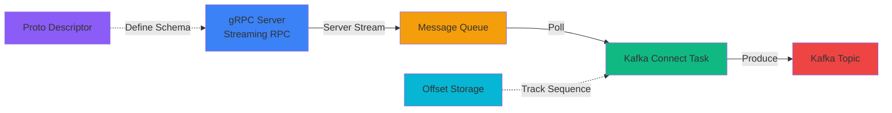

# Kafka Connect gRPC Source Connector

<div class="hero" markdown>

Stream real-time data from gRPC server streaming endpoints directly into Apache Kafka with automatic reconnection, TLS/mTLS support, and comprehensive monitoring.

[Get Started](getting-started/index.md){ .md-button .md-button--primary }
[View on GitHub](https://github.com/conduktor/kafka-connect-grpc){ .md-button }

</div>

## Features

### :material-cloud-sync: Server Streaming Support
Connect to any gRPC server streaming RPC and continuously receive messages with minimal latency and efficient resource usage.

### :material-code-json: Dynamic Proto Handling
Use Protocol Buffer descriptors for flexible message handling without requiring compiled proto classes - just provide your .desc file.

### :material-shield-lock: TLS/mTLS Support
Full TLS and mutual TLS support with configurable certificates for secure connections to production gRPC services.

### :material-sync: Automatic Reconnection
Built-in reconnection logic with exponential backoff ensures resilient connections even when gRPC servers restart or network issues occur.

### :material-gauge: Built-in Monitoring
Comprehensive JMX metrics, detailed logging with structured events, and integration with Prometheus/Grafana for production observability.

### :material-counter: Offset Management
Sequence-based offset tracking for reliable message delivery, enabling exactly-once semantics and gap detection across reconnections.

## Quick Example

Stream data from a gRPC service into Kafka:

=== "Connector Configuration"

    ```json
    {
      "name": "grpc-streaming-connector",
      "config": {
        "connector.class": "io.conduktor.connect.grpc.GrpcSourceConnector",
        "tasks.max": "1",
        "grpc.server.host": "localhost",
        "grpc.server.port": "9090",
        "grpc.service.name": "com.example.EventService",
        "grpc.method.name": "StreamEvents",
        "grpc.request.message": "{\"filter\":\"active\"}",
        "kafka.topic": "grpc-events"
      }
    }
    ```

=== "Deploy Connector"

    ```bash
    curl -X POST http://localhost:8083/connectors \
      -H "Content-Type: application/json" \
      -d @grpc-connector.json
    ```

=== "Consume Messages"

    ```bash
    kafka-console-consumer.sh \
      --bootstrap-server localhost:9092 \
      --topic grpc-events \
      --from-beginning
    ```

## Use Cases

The connector is ideal for streaming real-time data from:

- **Microservices Communication** - Stream events between microservices using gRPC server streaming
- **Event Streaming Platforms** - Ingest data from gRPC-based event streaming systems
- **Real-time Data Pipelines** - Connect gRPC data sources to Kafka-based data pipelines
- **Cloud-Native Applications** - Integrate with Kubernetes-native services exposing gRPC APIs
- **IoT & Telemetry** - Stream sensor data and metrics from gRPC-enabled devices
- **Financial Services** - Ingest market data, transaction streams, and risk feeds via gRPC

## Architecture



The connector uses gRPC's ManagedChannel for reliable connections, maintains an in-memory queue for buffering, and integrates seamlessly with Kafka Connect's task framework. Protocol Buffer descriptors enable dynamic message handling without code generation.

## Why This Connector?

| Feature | Kafka Connect gRPC | Custom Consumer | REST Polling |
|---------|-------------------|-----------------|--------------|
| Real-time streaming | ✅ Server streaming | ✅ Server streaming | ❌ Polling delays |
| Kafka integration | ✅ Native | ⚠️ Manual | ⚠️ Manual |
| Reconnection logic | ✅ Built-in | ⚠️ Custom code | ⚠️ Custom code |
| Monitoring | ✅ JMX/Prometheus | ⚠️ Custom | ⚠️ Custom |
| Deployment | ✅ Kafka Connect | ❌ Separate service | ❌ Separate service |
| TLS/mTLS | ✅ Built-in | ⚠️ Manual setup | ⚠️ Manual setup |
| Offset tracking | ✅ Sequence-based | ⚠️ DIY | ❌ Not applicable |

## Performance

- **Throughput**: Handles 10,000+ messages/second on standard hardware
- **Latency**: < 5ms from gRPC receipt to Kafka produce
- **Reliability**: Automatic reconnection with exponential backoff
- **Scalability**: Configurable queue size for traffic bursts
- **Message Size**: Supports up to 4MB messages (configurable)

## Operational Features

Includes comprehensive operational tooling:

- Detailed error handling and structured logging with MDC context
- JMX metrics for Prometheus/Grafana integration
- Automatic reconnection with exponential backoff
- Configurable message buffering with backpressure handling
- Sequence-based offset tracking for exactly-once semantics
- Gap detection for identifying potential message loss
- Extensive troubleshooting documentation and runbook

## Important: Offset Management

!!! info "Sequence-Based Offset Tracking"
    This connector implements sequence-based offset tracking:

    - **Session ID**: Unique identifier for each connection lifecycle
    - **Sequence Numbers**: Monotonically increasing counter for each message
    - **Gap Detection**: Automatically detects missing sequence numbers
    - **Resume Support**: Can resume from last committed offset after restart

    This enables reliable message delivery and helps identify potential data loss scenarios. However, the connector cannot replay messages from the gRPC server - it can only detect gaps in the sequence.

## Development & Testing

### Building from Source

```bash
git clone https://github.com/conduktor/kafka-connect-grpc.git
cd kafka-connect-grpc
mvn clean package
```

### Running Tests

```bash
# Unit tests
mvn test

# Integration tests (requires Docker)
mvn verify
```

The test suite includes:

- **Unit Tests**: Configuration validation, connector lifecycle, task management
- **Integration Tests**: gRPC client behavior, TLS configuration, proto descriptor handling
- **System Integration Tests** (`GrpcConnectorSystemIT`): Full end-to-end testing with Testcontainers that spins up Kafka + Kafka Connect containers

## Community & Support

- **GitHub Issues**: [Report bugs and request features](https://github.com/conduktor/kafka-connect-grpc/issues)
- **Slack Community**: [Join Conduktor Slack](https://conduktor.io/slack)
- **Documentation**: [Full reference guide](getting-started/index.md)

## License

Apache License 2.0 - see [LICENSE](https://github.com/conduktor/kafka-connect-grpc/blob/main/LICENSE) for details.

---

<div class="cta-section" markdown>

## Ready to Get Started?

[Getting Started Guide](getting-started/index.md){ .md-button .md-button--primary }
[View on GitHub](https://github.com/conduktor/kafka-connect-grpc){ .md-button }
[See FAQ](faq.md){ .md-button }

</div>
